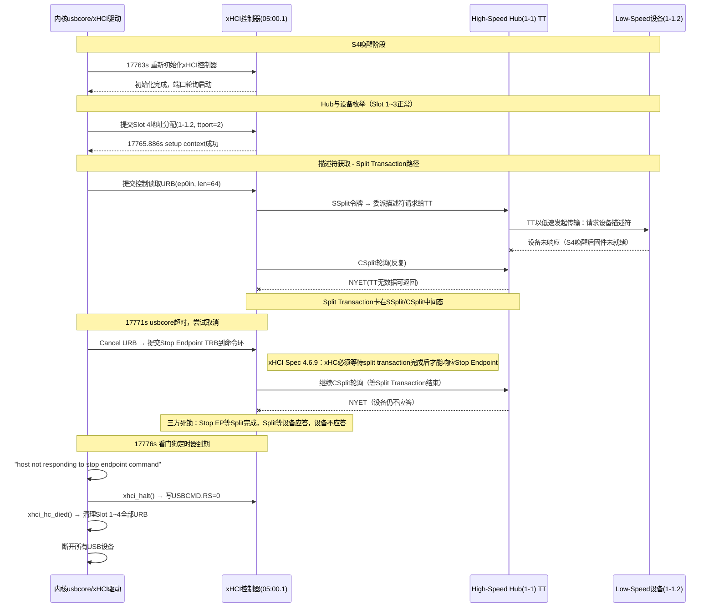

# [Bug-485653] XCP524P平台S4第500圈唤醒后前置及USB2.0接口失效

## 1. 故障现象与背景
在海康威视XCP524P平台上使用Linux PowerTest V1.0.5执行S4休眠压力测试，第500圈唤醒后出现前置USB接口与后置USB2.0接口全部失效，键盘鼠标无响应，仅后置USB3.0接口保留可用。进入BIOS后鼠标恢复正常，表明问题发生在操作系统层的驱动接管阶段，而非硬件物理故障。

**测试环境：**
- 主板: 海康威视XCP524P / BIOS: BIOS_IT60004_80021_20260112
- 内存: 威刚8G×2 / 硬盘: WTS NVMe 512G
- xHCI控制器: `0000:05:00.1`（USB2.0端口6个 + USB3.0端口4个）、`0000:05:00.2`（同）

## 2. 问题排查与源码解析
通过分析`halt.txt`内核日志（系统运行时间约17763秒处发生S4唤醒），逐步还原了xHCI控制器从正常恢复到被判定失效的完整过程。

### 2.1 S4唤醒与xHCI重新初始化（正常阶段）
`17763.515854`秒，内核打印`Waking up from system sleep state S4`，随后两个xHCI控制器（`05:00.1`和`05:00.2`）分别执行了标准的恢复流程：停止HCD → 释放旧的事件环和命令环 → 重新初始化 → 启动主/从HCD → 开启端口轮询。
```text
[17763.515854] ACPI: Waking up from system sleep state S4
[17763.650701] [68048] xhci_resume:1204: xhci_hcd 0000:05:00.1: Stop HCD
[17763.651147] [68048] xhci_dbg_trace:31: xhci_hcd 0000:05:00.1: Finished xhci_init
[17763.651475] [68048] xhci_resume:1288: xhci_hcd 0000:05:00.1: xhci_resume: starting port polling.
```
这一阶段两个控制器均正常完成初始化，端口上电正常。

### 2.2 Hub与设备枚举（正常阶段）
唤醒后，控制器`05:00.1`检测到以下设备拓扑并逐一完成地址分配：
- **Slot 1 → `usb 2-1`**：SuperSpeed USB3.0 Hub，挂载在`05:00.1`的USB3.0端口上。通过reset-resume流程正常恢复，TT配置完成。
- **Slot 2 → `usb 1-1`**：High-Speed USB2.0 Hub，挂载在`05:00.1`的USB2.0端口1上。该Hub内置TT（Transaction Translator），用于代理其下挂的低速/全速设备通讯。
- **Slot 3 → `usb 1-1.3`**：Low-Speed设备，挂载在Hub `1-1`的端口3下，`ttport=0x3`。地址分配和端点配置均成功。

```text
[17764.323897] [31551] xhci_update_hub_device:5182: xhci_hcd 0000:05:00.1: xHCI version 110 needs hub TT think time and number of ports
[17764.850434] usb 1-1.3: reset low-speed USB device number 3 using xhci_hcd
[17764.850438] [27203] xhci_setup_addressable_virt_dev:1200: xhci_hcd 0000:05:00.1: udev->ttport = 0x3
```

### 2.3 设备`1-1.2`的描述符获取超时（故障触发点）
**Slot 4 → `usb 1-1.2`**：同为Low-Speed设备，挂载在Hub `1-1`的端口2下，`ttport=0x2`。该设备在唤醒后等待了约740ms才被检测到连接（`Waited 740ms for CONNECT`），地址分配（setup context command）成功。但随后在获取设备描述符时（控制传输，ep0in，期望64字节），通讯停滞了约5.2秒：
```text
[17765.617943] [11804] wait_for_connected:3572: usb 1-1.2: Waited 740ms for CONNECT
[17765.886497] [11804] xhci_setup_addressable_virt_dev:1200: xhci_hcd 0000:05:00.1: udev->ttport = 0x2
[17765.886513] [11804] xhci_dbg_trace:31: xhci_hcd 0000:05:00.1: Successful setup context command
... (此处约5.2秒无任何日志输出)
[17771.078369] [11804] xhci_dbg_trace:31: xhci_hcd 0000:05:00.1: Cancel URB 00000000ae46b358, dev 1.2, ep 0x0, starting at offset 0xffb08000
```
从`17765.886518`（地址分配完成）到`17771.078369`（Cancel URB），中间约5.19秒内无任何该设备的日志。这说明内核提交的控制读取URB在ep0上悬挂未完成，达到超时阈值后由usbcore层发起了取消操作。

### 2.4 Stop Endpoint命令超时与协议级死锁（故障根因）
Cancel URB操作触发了xHCI驱动向控制器命令环提交Stop Endpoint TRB。但控制器在约5秒内未在事件环上返回该命令的Command Completion Event。这不是控制器固件挂死，而是xHCI规范（Section 4.6.9）中明确定义的一个边界行为：

> **"The xHC shall wait for any partially completed USB2 split transactions to finish before completing the Stop Endpoint Command."**
> — xHCI Specification, Section 4.6.9, Page 141

即：当Stop Endpoint命令下发时，如果该端点上存在尚未完成的USB2 Split Transaction，**xHC必须等这个Split Transaction结束后才能返回完成事件**。而此时ep0上的Split Transaction正卡在CSplit轮询阶段（设备不应答，Hub TT无法返回数据），形成了三方依赖死锁：
- Stop Endpoint的完成 → 依赖Split Transaction结束
- Split Transaction的结束 → 依赖Hub TT返回数据或错误
- Hub TT返回数据 → 依赖低速设备应答（设备不应答）

```text
[17771.078369] [11804] xhci_dbg_trace:31: xhci_hcd 0000:05:00.1: Cancel URB 00000000ae46b358, dev 1.2, ep 0x0
... (约5.12秒，xHC等待split transaction完成，无法响应stop endpoint)
[17776.198475] xhci_hcd 0000:05:00.1: xHCI host not responding to stop endpoint command.
[17776.208562] xhci_hcd 0000:05:00.1: xHCI host controller not responding, assume dead
[17776.208585] xhci_hcd 0000:05:00.1: HC died; cleaning up
[17776.208629] [11804] usb_start_wait_urb:66: usb 1-1.2: kworker/u32:78 timed out on ep0in len=0/64
```

### 2.5 控制器全局清理与设备断开（连锁后果）
内核看门狗定时器到期后，对`05:00.1`控制器执行了`xhci_hc_died()`处理：遍历清理该控制器下所有slot（1~4）的所有endpoint上悬挂的URB，随后将该控制器挂载的所有USB设备全部断开：
```text
[17776.208564] Killing URBs for slot ID 1, ep index 0
[17776.208566] Killing URBs for slot ID 1, ep index 2
[17776.208571] Killing URBs for slot ID 2, ep index 0
...
[17776.209530] usb 2-1: USB disconnect, device number 2
[17776.209531] usb 1-1: USB disconnect, device number 2
[17776.209532] usb 1-1.2: USB disconnect, device number 4
```
由于`05:00.1`同时管理着USB2.0端口（含前置）和部分USB3.0端口，该控制器失效导致了前置USB和后置USB2.0全部不可用。另一个控制器`05:00.2`未受波及，其管理的后置USB3.0接口仍可正常使用，与故障现象吻合。

## 3. 关联知识梳理与底层协议背景

### Hub TT（Transaction Translator）与Split Transaction

#### 协议依据
Split Transaction的通讯流程定义在两份规范中：

**USB 2.0 Specification：**
- **Section 8.4.2** "Split Transaction Special Token Packets"：定义了SPLIT特殊令牌（4字节），包含Hub Address、Port、SC（Start/Complete）、Endpoint Type等字段。SC=0表示Start-Split（SSPLIT），SC=1表示Complete-Split（CSPLIT）。原文明确限定Split Transaction只用于主控与Hub之间：*"Split transactions are only defined to be used between the host controller and a hub. No other high-speed or full-/low-speed devices ever use split transactions."*（Section 8.4.2.1）
- **Section 8.4.2.2** "Start-Split Transaction Token"：定义SSPLIT令牌的字段格式（Figure 8-10）
- **Section 8.4.2.3** "Complete-Split Transaction Token"：定义CSPLIT令牌的字段格式（Figure 8-12）
- **Chapter 11**（Hub Specification）：定义了各传输类型的Split Transaction完整状态机。与本次故障直接相关的Bulk/Control IN路径对应以下图表：
  - Figure 11-50：Bulk/Control IN Start-split Transaction Sequence
  - Figure 11-51：Bulk/Control IN Complete-split Transaction Sequence
  - Figure 11-56/11-57：Bulk/Control IN Start/Complete-split Transaction Host State Machine
  - Figure 11-58/11-59：Bulk/Control IN Start/Complete-split Transaction TT State Machine

**xHCI Specification：**
- xHCI规范不重新定义SSplit/CSplit的令牌格式和总线交互（那是USB 2.0协议层定义的），但定义了xHC作为主控如何管理这些事务：
  - **Section 4.6.9** "Stop Endpoint"（Page 141）：定义Stop Endpoint命令必须等待未完成的Split Transaction
  - **Section 4.10.3.3** "Split Transaction Error"（Page 207）：定义当xHC无法调度CSplit时应报告错误并halt端点

#### 通讯流程
根据上述规范，当High-Speed Hub下挂载Low-Speed或Full-Speed设备时，xHCI主控无法直接以低速率与设备通讯。以Bulk/Control IN传输（本次故障涉及的描述符获取）为例，流程如下：
1. 主控以高速向Hub发送**SSPLIT令牌**（SC=0）+ **IN令牌**（目标设备地址+端点号），将传输请求委派给Hub的TT
2. Hub内部的TT模块将请求转换为低速/全速信号，向目标设备发起IN传输并等待数据返回
3. 主控随后发送**CSPLIT令牌**（SC=1）+ **IN令牌**，向Hub轮询传输结果
4. 如果TT尚未收到设备的数据响应，Hub返回**NYET**握手，主控在下一个微帧继续CSplit轮询
5. 如果TT已收到设备的数据，Hub返回**DATA包**，主控回复**ACK**，Split Transaction完成

注意：NYET在USB 2.0协议中是**合法的握手响应**（Section 8.4.2，Table 8-2），表示"尚无结果"，不被视为总线错误，因此不会触发xHCI的CErr（Bus Error Counter）递减机制。

#### 本次故障中的Split Transaction路径
在本次S4唤醒场景中，设备`1-1.2`连接建立缓慢（740ms），其后的描述符请求又出现了5秒级别的长时间无响应。可能的原因是：Hub的TT在S4供电恢复后内部状态尚未完全就绪，或者设备`1-1.2`自身固件复位速度慢，导致TT发起的低速传输得不到ACK应答，CSplit轮询持续返回NYET。由于NYET不触发CErr递减，xHC无法通过标准的错误计数机制终止这个传输——Split Transaction就此卡在"合法的等待"状态中。

### xHCI规范对Stop Endpoint与Split Transaction的约束（Section 4.6.9）
根据xHCI规范Section 4.6.9的定义，Stop Endpoint Command的正常执行流程是：
1. xHC停止该端点的USB传输活动
2. 如果命令中断了正在执行的TD，生成一个Transfer Event（Completion Code = Stopped）
3. 将端点状态设置为Stopped
4. 生成Command Completion Event（Completion Code = Success）

但规范在该章节末尾（Page 141）附加了一条关键约束：
> **"The xHC shall wait for any partially completed USB2 split transactions to finish before completing the Stop Endpoint Command."**

这意味着xHC在处理Stop Endpoint时，如果该端点上有一个处于"SSplit已发出、CSplit尚未完成"中间态的Split Transaction，xHC**不能跳过它直接完成命令**，而必须等待这个Split Transaction走完。xHCI规范没有为这个"等待"定义超时上限——如果Split Transaction永远不结束（比如Hub TT和低速设备之间通讯卡死），xHC就会无限期地等下去，永远不返回Command Completion Event。

### 内核侧的看门狗与"Assume Dead"机制
内核在提交Stop Endpoint命令时会启动一个看门狗定时器。从kfocal源码`drivers/usb/host/xhci-ring.c`（第1020~1068行）可以看到该定时器的回调函数：
```c
/* Watchdog timer function for when a stop endpoint command fails to complete.
 * In this case, we assume the host controller is broken or dying or dead.
 */
void xhci_stop_endpoint_command_watchdog(struct timer_list *t)
{
    struct xhci_virt_ep *ep = from_timer(ep, t, stop_cmd_timer);
    struct xhci_hcd *xhci = ep->xhci;
    // ...
    xhci_warn(xhci, "xHCI host not responding to stop endpoint command.\n");
    xhci_halt(xhci);     // 尝试写USBCMD.RS=0停止控制器
    xhci_hc_died(xhci);  // 标记XHCI_STATE_DYING，清理所有slot和URB
}
```
定时器到期后，内核将控制器判定为无响应并执行`xhci_hc_died()`，遍历所有slot的所有endpoint清理悬挂的URB，然后通过`usb_hc_died()`通知USB核心层断开该控制器管理的全部设备。这是一种保护机制，但代价是该控制器管理的所有USB端口全部离线。

在本次故障中，控制器本身并没有真正"死掉"——它只是在严格遵守xHCI规范，等待一个永远不会结束的Split Transaction。内核的看门狗无法区分"控制器死了"和"控制器在等Split Transaction"，只能一律按最坏情况处理。

### 故障时序图


## 4. 结论与排查建议
**根本原因：**
S4唤醒后，挂载在High-Speed Hub `1-1`下的Low-Speed设备`1-1.2`（ttport=2）在经由Hub TT的Split Transaction获取设备描述符时通讯停滞。内核在URB超时后下发Stop Endpoint命令试图取消传输，但根据xHCI规范Section 4.6.9的要求，xHC必须等待该端点上未完成的Split Transaction结束后才能响应Stop Endpoint命令。由于Split Transaction本身因设备不应答而无法完成，形成了协议级的三方死锁（Stop EP ↔ Split Transaction ↔ 设备应答），最终导致内核看门狗将控制器判定为失效（"assume dead"），整个`05:00.1`控制器被逻辑卸载，其管理的前置USB和后置USB2.0端口全部离线。

**已验证结论：**
- 同一Hub下`1-1.3`（ttport=3）的低速设备成功完成了枚举，说明Hub TT并非完全不可用
- **将设备绕过Hub直连到后置USB3.0端口（不经过Hub TT的Split Transaction路径）后，S4唤醒正常，问题不再复现**。这确认了故障路径就是Hub TT的Split Transaction链路，设备自身在直连时可以正常完成S4唤醒恢复
- **软件规避方案验证（均宣告无效）**：目前已在软件侧尝试以下多种规避手段，但均无法阻止控制器挂死：
  1. `usbcore.autosuspend=-1`、禁用 `1-1` Hub的LPM链路电源管理。
  2. 调整 `1-1` Hub上电后的稳定延时（`hub_power_on_good_delay`）。
  3. 针对该Hub添加内核quirk（`USB_QUIRK_HUB_SLOW_RESET`）。
  4. 使用高版本的社区内核（Linux v6.17）进行验证，高版本内核同样出现控制器挂死。

**定性：** 该问题的触发需要同时满足两个条件：（1）低速设备通过Hub TT走Split Transaction通讯；（2）设备在S4唤醒后响应慢或TT转发异常导致Split Transaction卡死。直连时不走Split Transaction路径，因此不受影响。

**排查建议：**
1. **确认设备`1-1.2`的身份**：通过正常启动时的`lsusb`输出确认该设备的VID/PID和类型。如果是键盘或鼠标，尝试替换为其他型号复测，验证是否为特定设备固件唤醒慢导致。
2. **Hub芯片排查**：确认前置USB扩展采用的Hub芯片型号及TT实现。结合TI TUSB73x0 errata（SLLZ076第6条）中记录的类似Split Transaction与Stop Endpoint交互问题，排查该Hub芯片在S4供电恢复后TT的初始化时序是否符合USB2.0规范要求。
3. **内核层Workaround**：可考虑对该设备的VID/PID添加`USB_QUIRK_DELAY_INIT`或类似的初始化延迟quirk，避免内核在TT和设备尚未完全就绪时过早发起控制传输。
4. **xHCI控制器芯片固件改进方向**：xHCI规范没有为"等待Split Transaction完成"定义超时上限，这是此次死锁的协议级根源。可与该xHCI控制器芯片厂商（通过`lspci -nn`确认VID/PID）确认：是否可以在CSplit轮询阶段增加内部超时机制，超时后以错误码完成Split Transaction，从而让Stop Endpoint命令能够正常返回，避免整个控制器被内核判定失效。
5. **xHCI固件排查**：日志中`xhci_stop completed - status = 11`，需与固件厂商确认该返回值在resume路径上的具体含义。
