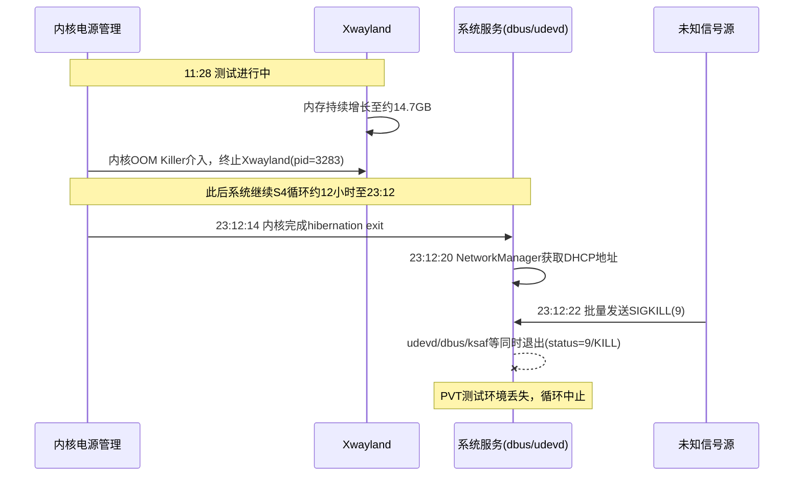

# [Bug-521287] Shuda N256Z S4循环压力测试不足500次中止

## 1. 故障现象与背景
在装配兆芯KX-7000处理器及Shuda N256Z主板的环境中，使用PVT工具执行S4（休眠到磁盘）循环压力测试。目标1000次，实际运行不到500次后中止。测试中止时系统并未卡在休眠或唤醒的硬件流程中，而是在某次唤醒后，多个系统基础服务进程异常退出，PVT测试脚本因运行环境丢失而停止。

**测试环境：**
- CPU: 兆芯KX-7000 / 内存: 16GB Samsung 5600MT/s
- 硬盘: MAXIO 256GB / 无线: RTL8852BE
- 系统: Kylin-Desktop-V11-2603 (buildid: 83681)

## 2. 问题排查与源码解析
通过对`kern.log`（约85MB）和`syslog`截图（S4_ok、S4_ok_1、S4_fail三组对照）的交叉比对，逐步收窄问题范围。

### 2.1 排除项：USB挂起报错（error -32）
在所有S4循环（包括成功和失败的周期）中，均稳定出现以下日志：
```text
Apr  8 23:09:36 test-pc kernel: [ 7394.389671][ 1] [T251600] usb 2-4.4: Failed to suspend device, error -32
```
该报错对应RTL8852BE蓝牙模块在autosuspend时返回`-EPIPE`，属于该固件的已知行为。三组对照日志均包含此条目且后续S4流程正常完成，确认与本次测试中止无关。

### 2.2 排除项：OOM Killer Disabled/Enabled打印
`kern.log`中每个S4周期都交替出现`OOM killer disabled`和`OOM killer enabled`，共计数百条。这是Linux内核电源管理框架（`kernel/power/process.c`）在冻结/解冻进程时的标准行为——进入休眠前禁用OOM防止误杀已冻结进程，唤醒后重新启用。这些打印不代表内存不足，属于正常的S4流程日志。

### 2.3 事件一：测试前期OOM触发（11:28）
距最终中止约12小时前，内核检测到用户态进程内存占用过大，触发了OOM Killer：
```text
Apr  8 11:28:56 test-pc kernel: [34536.806115][ 3] [T96407] glmark2-es2-way invoked oom-killer: gfp_mask=0x440dc0 ...
Apr  8 11:28:56 test-pc kernel: [34536.809356][ 4] [T96407] oom-kill:constraint=CONSTRAINT_NONE, ... task=peony-qt-deskto,pid=3282,uid=1000
Apr  8 11:28:56 test-pc kernel: [34536.809608][ 4] [T96407] Out of memory: Killed process 3282 (peony-qt-deskto) total-vm:3023860kB ...
Apr  8 11:29:49 test-pc kernel: [34589.761429][ 4] [ T3283] Xwayland invoked oom-killer: gfp_mask=0x140cca ...
Apr  8 11:29:49 test-pc kernel: [34589.763623][ 7] [ T3283] Out of memory: Killed process 3283 (Xwayland) total-vm:14713244kB, anon-rss:11668kB ...
```
日志显示`Xwayland`虚拟内存占用达到约14.7GB，`peony-qt-desktop`（Kylin文件管理器）占用约3GB，二者先后被内核OOM终止。触发源头是`glmark2-es2-way`（GPU基准测试工具），说明在长时间S4循环过程中，图形栈相关进程存在内存泄漏。

### 2.4 事件二：最终循环的批量SIGKILL（23:12）
在最终中止的那个周期，系统从S4正常唤醒并完成网络重连后，多个不相关的核心服务在同一秒内被`SIGKILL`终止：
```text
Apr  8 23:12:14 test-pc kernel: [ 7434.488771] PM: hibernation: hibernation exit
Apr  8 23:12:20 test-pc NetworkManager[1141]: <info> [1775661140.4327] dhcp4 (wlp1s0): state changed new lease, address=192.168.12.212
Apr  8 23:12:22 test-pc kernel: [ 7441.320159] audit: type=1131 ... msg='unit=ksaf-audit-daemon comm="systemd" ... res=failed'
Apr  8 23:12:22 test-pc kernel: [ 7441.327743] audit: type=1131 ... msg='unit=auditd comm="systemd" ... res=failed'
Apr  8 23:12:22 test-pc systemd[1]: systemd-udevd.service: Main process exited, code=killed, status=9/KILL
Apr  8 23:12:22 test-pc systemd[1]: kyseclogd.service: Main process exited, code=killed, status=9/KILL
Apr  8 23:12:22 test-pc systemd[1]: dbus.service: Main process exited, code=killed, status=9/KILL
```
关键特征：
- 23:12:14内核正常完成`hibernation exit`
- 23:12:20网络正常获取DHCP地址
- 23:12:22，仅2秒后，`udevd`/`dbus`/`ksaf-audit-daemon`/`kyseclogd`等服务同时收到`SIGKILL(9)`退出
- 该时间点**未观测到OOM相关日志**，排除内存不足触发
- 各服务退出码均为`status=9/KILL`而非`status=0`正常退出，说明未经过标准的`SIGTERM`停止流程

对比成功周期（S4_ok、S4_ok_1），成功时系统在WiFi连接后正常发起`PrepareForSleep` D-Bus广播并平滑进入下一轮休眠，不存在批量进程退出现象。

## 3. 关联知识梳理与底层协议背景

### S4循环中OOM Killer的状态切换机制
在Linux内核的S4流程中，电源管理框架在冻结进程前会调用`oom_killer_disable()`，防止OOM在内存镜像写盘阶段误杀已冻结的进程。唤醒完成后再调用`oom_killer_enable()`恢复正常的内存保护。因此`kern.log`中每个S4周期出现的`OOM killer disabled/enabled`配对属于标准行为，不应与实际的内存溢出混淆。

### 事件时序图


## 4. 结论与排查建议
**结论：** 经日志排查确认，S4休眠与唤醒的内核流程在整个测试过程中均正常工作。测试中止由两个用户态层面的问题导致：前期图形栈内存泄漏触发OOM，后期未知高权限源发送批量SIGKILL导致基础服务退出。两者均不属于内核休眠机制的问题。

**排查建议（流转方向）：**
1. **Kylin桌面图形组件组**：排查`Xwayland`和`peony-qt-desktop`在反复S4唤醒场景下的内存泄漏问题，日志显示单进程虚拟内存增长至14.7GB。
2. **PVT自动化测试组**：排查测试脚本在唤醒后的状态检测逻辑，确认是否存在超时后执行无差别`kill -9`的清场操作。
3. **Kylin安全审计组件组**：排查`ksaf-audit-daemon`等安全组件在经历数百次休眠唤醒周期后，是否存在触发异常保护策略导致批量终止进程的情况。
