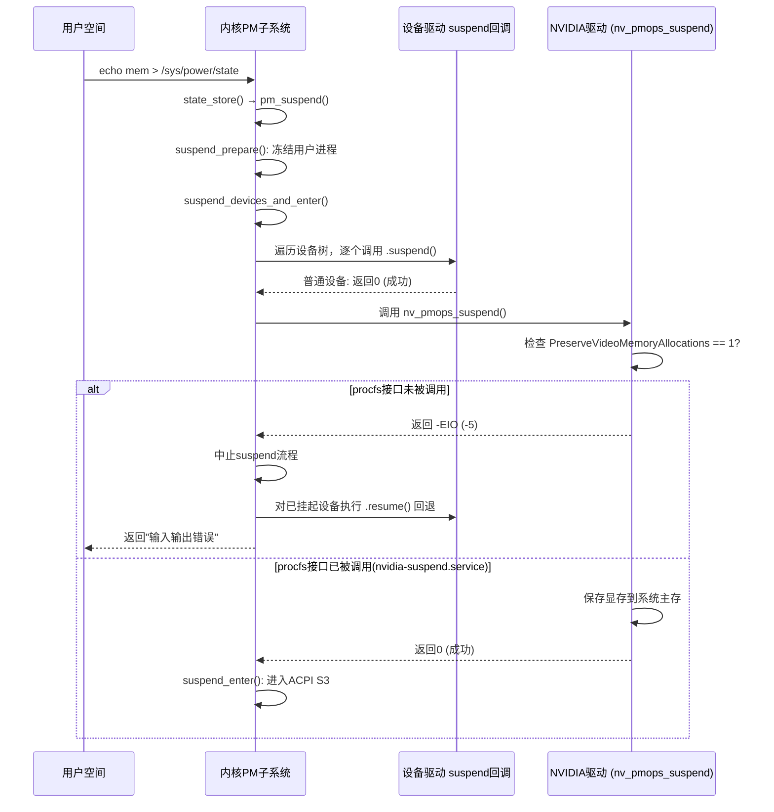

# [Bug-525775] NVIDIA驱动PreserveVideoMemoryAllocations机制未配置导致曙光T50P平台S3睡眠失败

> **文档版本**：v1.0
> **生成日期**：2026-04-23
> **变更摘要**：初始版本，基于dmesg日志分析定位根因。
> **基于内核版本**：6.6.0-63-generic
> **涉及硬件/平台**：曙光T50P / Hygon C86-4G / NVIDIA RTX 4000 Ada (AD104GL)
> **NVIDIA驱动版本**：570.211.01
>
> **版本历史**：
>
> | 版本 | 日期 | 变更摘要 |
> |------|------|----------|
> | v1.0 | 2026-04-23 | 初始版本，定位NVIDIA驱动PreserveVideoMemoryAllocations机制为根因 |

---

## 1. 故障现象与背景

**Bug编号**：525775

曙光T50P工作站，搭载Hygon C86-4G CPU和NVIDIA RTX 4000 Ada显卡，运行银河麒麟桌面操作系统V11（内核6.6.0-63-generic）。在终端执行 `echo mem > /sys/power/state` 尝试进入S3（Suspend-to-RAM）睡眠时，命令返回"输入输出错误"，系统未能进入睡眠状态，随后自动恢复至正常运行。

系统ACPI层确认支持S3状态（`ACPI: PM: (supports S0 S3 S4 S5)`），问题不在BIOS或硬件层面。

## 2. 问题排查与源码解析

### 日志分析

系统启动后约50秒触发suspend流程，内核依次完成进程冻结、设备挂起准备，但在调用NVIDIA驱动的suspend回调时被拒绝。以下是决定性的日志片段：

```log
[   50.402629] PM: suspend entry (deep)
[   50.417265] PM: Preparing system for sleep (deep)
[   50.542093] PM: Suspending system (deep)
[   50.542125] printk: Suspending console(s) (use no_console_suspend to debug)
```

以上为正常的suspend流程启动阶段，接下来执行到NVIDIA GPU设备（PCI地址0000:81:00.0）的suspend回调时触发错误：

```log
[   50.565617] NVRM: GPU 0000:81:00.0: PreserveVideoMemoryAllocations module parameter is set. System Power Management attempted without driver procfs suspend interface. Please refer to the 'Configuring Power Management Support' section in the driver README.
[   50.565622] nvidia 0000:81:00.0: PM: pci_pm_suspend(): nv_pmops_suspend+0x0/0x70 [nvidia] returns -5
[   50.566172] nvidia 0000:81:00.0: PM: dpm_run_callback(): pci_pm_suspend+0x0/0x180 returns -5
[   50.566180] nvidia 0000:81:00.0: PM: failed to suspend async: error -5
```

NVIDIA驱动返回错误码 `-5`（即内核中的 `EIO`，对应用户态看到的"输入输出错误"），随后整个suspend流程被中止：

```log
[   61.027884] PM: suspend of devices aborted after 10485.494 msecs
[   61.027890] PM: Some devices failed to suspend, or early wake event detected
[   64.855832] PM: suspend exit
```

### 内核机制定位

NVIDIA闭源驱动的suspend流程中，`nv_pmops_suspend()` 函数会执行以下检查：

1. 检测模块参数 `NVreg_PreserveVideoMemoryAllocations` 的值
2. 若该参数为1（默认开启），则要求用户空间必须通过 `/proc/driver/nvidia/suspend` 接口预先下发suspend命令
3. 若检测到未经过该procfs接口直接触发系统suspend，驱动直接返回 `-EIO` 拒绝操作

这是一个**主动拒绝**行为，不是硬件故障或内核缺陷。NVIDIA驱动的 `PreserveVideoMemoryAllocations` 机制设计用于在系统睡眠期间保存和恢复显存内容（对于专业卡和工作站场景很重要），但该机制需要配套的用户空间systemd服务来协调电源管理时序。

## 3. 关联知识梳理与底层协议背景

### 背景知识补充

**Linux PM Subsystem与驱动suspend回调机制**：

Linux内核的电源管理子系统（PM Subsystem）在执行 `echo mem > /sys/power/state` 时，会按照以下流程逐层调用：

1. `state_store()` → 解析用户写入的状态字符串
2. `pm_suspend()` → PM核心入口
3. `suspend_prepare()` → 冻结用户空间进程、禁用OOM killer
4. `suspend_devices_and_enter()` → 遍历设备树，调用每个驱动的 `.suspend()` 回调
5. `suspend_enter()` → 所有设备挂起后，执行ACPI过渡进入目标睡眠状态

在步骤4中，任何一个驱动的 `.suspend()` 回调返回非零错误码，整个流程即被中止，所有已挂起的设备按逆序执行 `.resume()` 回调恢复运行。

**NVIDIA PreserveVideoMemoryAllocations机制**：

从NVIDIA驱动470xx版本开始引入。该机制的目的在于：专业GPU（如RTX 4000 Ada）在系统睡眠期间，显存中的数据需要被保存到系统主存中，在唤醒时再恢复回显存。这需要用户空间的systemd服务在系统suspend/resume的特定阶段通过 `/proc/driver/nvidia/suspend` 接口与驱动协作完成。

涉及的systemd服务：
- `nvidia-suspend.service` — 系统挂起前保存显存
- `nvidia-resume.service` — 系统恢复后还原显存
- `nvidia-hibernate.service` — 休眠（S4）场景

### 架构流转流程图



## 4. 结论与解决方案

**根本原因（Root Cause）**：

NVIDIA驱动570.211.01的模块参数 `PreserveVideoMemoryAllocations` 默认启用，该参数要求用户空间通过 `/proc/driver/nvidia/suspend` 接口配合驱动完成显存保存/恢复流程。当前银河麒麟V11系统上未启用 `nvidia-suspend.service` 等配套systemd服务，导致驱动在suspend回调中检测到procfs接口未被调用后，主动返回 `-EIO` 拒绝系统进入S3睡眠。

**解决方案（Solution / Workaround）**：

- **方案一（推荐，启用NVIDIA PM服务）**：
  ```bash
  sudo systemctl enable nvidia-suspend.service
  sudo systemctl enable nvidia-resume.service
  sudo systemctl enable nvidia-hibernate.service
  sudo systemctl start nvidia-suspend.service
  sudo systemctl start nvidia-resume.service
  sudo systemctl start nvidia-hibernate.service
  ```
  启用后重新测试 `echo mem > /sys/power/state`。此方案保留显存内容，suspend/resume后图形应用状态不丢失。

- **方案二（禁用PreserveVideoMemoryAllocations）**：
  创建或编辑 `/etc/modprobe.d/nvidia.conf`，添加：
  ```
  options nvidia NVreg_PreserveVideoMemoryAllocations=0
  ```
  重启后生效。此方案下驱动不再要求procfs接口配合，suspend流程可以正常执行，但suspend/resume后显存内容丢失，正在运行的图形应用可能出现异常。

- **方案三（集成到系统镜像）**：
  建议银河麒麟在系统镜像或NVIDIA驱动安装包中默认启用这三个systemd服务，避免OEM整机导入时反复遇到同类问题。
