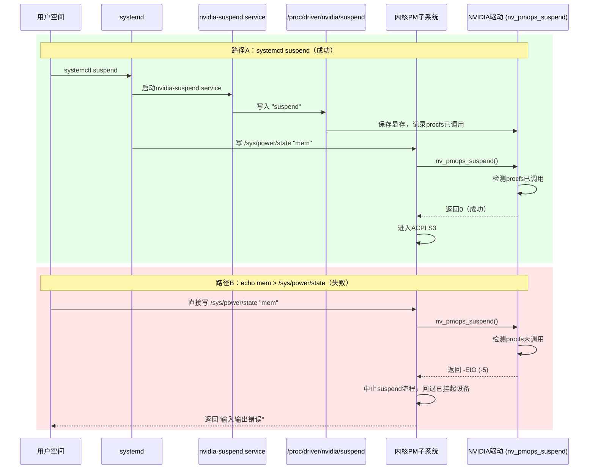

# [Bug-525775] 直接写/sys/power/state绕过systemd协调层导致NVIDIA驱动拒绝S3睡眠

> **文档版本**：v1.1
> **生成日期**：2026-04-23
> **变更摘要**：v1.1 — 根据测试反馈修正结论：systemd服务睡眠正常，问题仅限于直接写 `/sys/power/state` 绕过协调层的场景。
> **基于内核版本**：6.6.0-63-generic
> **涉及硬件/平台**：曙光T50P / Hygon C86-4G / NVIDIA RTX 4000 Ada (AD104GL)
> **NVIDIA驱动版本**：570.211.01
>
> **版本历史**：
>
> | 版本 | 日期 | 变更摘要 |
> |------|------|----------|
> | v1.0 | 2026-04-23 | 初始版本，定位NVIDIA驱动PreserveVideoMemoryAllocations机制为根因 |
> | v1.1 | 2026-04-23 | 根据测试反馈修正：systemctl suspend正常，仅直接写sysfs失败。问题本质是操作方式绕过了systemd协调层 |

---

## 1. 故障现象与背景

**Bug编号**：525775

曙光T50P工作站，搭载Hygon C86-4G CPU和NVIDIA RTX 4000 Ada显卡，运行银河麒麟桌面操作系统V11（内核6.6.0-63-generic，NVIDIA驱动570.211.01）。在终端执行 `echo mem > /sys/power/state` 尝试进入S3睡眠时，命令返回"输入输出错误"，系统未能进入睡眠。

**关键测试结论**：通过系统服务 `systemctl suspend` 触发睡眠可以正常进入S3并成功唤醒。问题仅在直接写 `/sys/power/state` 时出现。

系统ACPI层确认支持S3状态（`ACPI: PM: (supports S0 S3 S4 S5)`），BIOS和硬件层面无问题。

## 2. 问题排查与源码解析

### 日志分析

系统启动后约50秒，通过直接写 `/sys/power/state` 触发suspend流程，内核依次完成进程冻结、设备挂起准备，但在调用NVIDIA驱动的suspend回调时被拒绝：

```log
[   50.402629] PM: suspend entry (deep)
[   50.417265] PM: Preparing system for sleep (deep)
[   50.542093] PM: Suspending system (deep)
[   50.542125] printk: Suspending console(s) (use no_console_suspend to debug)
```

执行到NVIDIA GPU（PCI地址0000:81:00.0）的suspend回调时触发错误：

```log
[   50.565617] NVRM: GPU 0000:81:00.0: PreserveVideoMemoryAllocations module parameter is set. System Power Management attempted without driver procfs suspend interface. Please refer to the 'Configuring Power Management Support' section in the driver README.
[   50.565622] nvidia 0000:81:00.0: PM: pci_pm_suspend(): nv_pmops_suspend+0x0/0x70 [nvidia] returns -5
[   50.566172] nvidia 0000:81:00.0: PM: dpm_run_callback(): pci_pm_suspend+0x0/0x180 returns -5
[   50.566180] nvidia 0000:81:00.0: PM: failed to suspend async: error -5
```

随后整个suspend流程被中止并回退：

```log
[   61.027884] PM: suspend of devices aborted after 10485.494 msecs
[   61.027890] PM: Some devices failed to suspend, or early wake event detected
[   64.855832] PM: suspend exit
```

### 内核机制定位

NVIDIA驱动的suspend回调函数 `nv_pmops_suspend()` 执行以下检查：

1. 检测模块参数 `NVreg_PreserveVideoMemoryAllocations` 的值（默认为1）
2. 若为1，则要求用户空间已通过 `/proc/driver/nvidia/suspend` 接口预先下发suspend命令
3. 若未检测到procfs接口调用记录，驱动直接返回 `-EIO`（错误码-5）拒绝操作

### 两种睡眠路径的差异

```
路径A（systemctl suspend → 成功）：
  systemd → nvidia-suspend.service → 写 /proc/driver/nvidia/suspend "suspend"
         → NVIDIA驱动记录procfs调用
         → systemd → 写 /sys/power/state "mem"
         → 内核PM → nv_pmops_suspend() 检测到procfs已调用 → 返回0 → 成功

路径B（echo mem > /sys/power/state → 失败）：
  用户直接 → 写 /sys/power/state "mem"
         → 内核PM → nv_pmops_suspend() 未检测到procfs调用 → 返回-EIO → 失败
```

核心差异：路径A在写 `/sys/power/state` 之前，systemd会先调用 `nvidia-suspend.service` 通过 `/proc/driver/nvidia/suspend` 接口通知NVIDIA驱动准备睡眠，驱动在此阶段完成显存保存。路径B跳过了这个协调步骤，NVIDIA驱动检测到procfs接口未被调用，主动拒绝suspend。

## 3. 关联知识梳理与底层协议背景

### 背景知识补充

**Linux PM Subsystem与驱动suspend回调机制**：

Linux内核的电源管理子系统在执行 `echo mem > /sys/power/state` 时，流程如下：

1. `state_store()` → 解析用户写入的状态字符串
2. `pm_suspend()` → PM核心入口
3. `suspend_prepare()` → 冻结用户空间进程、禁用OOM killer
4. `suspend_devices_and_enter()` → 遍历设备树，调用每个驱动的 `.suspend()` 回调
5. `suspend_enter()` → 所有设备挂起后，执行ACPI过渡进入目标睡眠状态

步骤4中，任一驱动的 `.suspend()` 返回非零错误码，整个流程中止，已挂起设备按逆序resume恢复。

**NVIDIA PreserveVideoMemoryAllocations机制**：

从NVIDIA驱动470xx版本引入。该机制在系统睡眠前将显存内容保存到系统主存（通过临时文件），唤醒时恢复。用于专业GPU场景，确保睡眠/唤醒后图形应用状态不丢失。

涉及的systemd服务：
- `nvidia-suspend.service` — 系统挂起前通过procfs接口通知驱动保存显存
- `nvidia-resume.service` — 系统恢复后通过procfs接口通知驱动还原显存
- `nvidia-hibernate.service` — 休眠（S4）场景

### 架构流转流程图



## 4. 结论与解决方案

**根本原因（Root Cause）**：

NVIDIA驱动570.211.01的模块参数 `NVreg_PreserveVideoMemoryAllocations` 默认启用，该参数要求系统在写 `/sys/power/state` 触发睡眠前，必须先通过 `/proc/driver/nvidia/suspend` 接口通知驱动完成显存保存。使用 `systemctl suspend` 时，systemd会自动调用 `nvidia-suspend.service` 完成这一协调步骤，因此睡眠正常。而直接写 `/sys/power/state` 跳过了systemd的协调层，NVIDIA驱动检测到procfs接口未被调用，主动返回 `-EIO` 拒绝suspend。

**结论**：这是NVIDIA驱动的设计行为，不是系统缺陷。直接写 `/sys/power/state` 不经过systemd的设备电源管理协调，属于非标准的睡眠触发方式。

**解决方案（Solution / Workaround）**：

- **方案一（推荐，使用标准睡眠命令）**：
  使用 `systemctl suspend` 替代 `echo mem > /sys/power/state` 触发睡眠。这是NVIDIA驱动官方文档推荐的标准操作方式，systemd会自动协调NVIDIA驱动的电源管理流程。

- **方案二（禁用PreserveVideoMemoryAllocations）**：
  创建或编辑 `/etc/modprobe.d/nvidia.conf`，添加：
  ```
  options nvidia NVreg_PreserveVideoMemoryAllocations=0
  ```
  重启后生效。此方案下驱动不再要求procfs接口配合，直接写 `/sys/power/state` 也可正常睡眠，但suspend/resume后显存内容丢失，正在运行的图形应用可能出现异常。

- **方案三（如需保留两种睡眠方式）**：
  在直接写 `/sys/power/state` 之前，手动调用NVIDIA的procfs接口：
  ```bash
  echo suspend > /proc/driver/nvidia/suspend
  echo mem > /sys/power/state
  ```
  唤醒后手动恢复：
  ```bash
  echo resume > /proc/driver/nvidia/suspend
  ```
