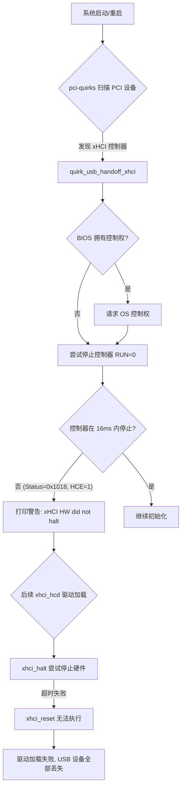

# [Bug-526691] Zhaoxin KX-7000 平台 reboot 测试掉 USB 设备分析报告

## 1. 故障现象与背景

在兆芯 (Zhaoxin) KX-7000 平台（机型：Shanghai Zhaoxin Semiconductor Co., Ltd. ZXE CRB）上进行系统重启 (reboot) 压力测试时，偶发性出现重启后所有 USB 设备（包括控制器、Hub 及外设）全部丢失的现象。

该问题发生在 Kylin-Desktop-V10-SP1 系统环境下，内核版本为 5.4.18-142-generic。期望结果是重启 1000 次无掉设备现象。

## 2. 问题排查与源码解析

### 2.1 日志分析

通过分析故障现场的 `dmesg` 日志，发现 xHCI 控制器 (0000:00:12.0) 在内核初始化的早期阶段就已报错：

```text
[    0.368096] kernel: pci 0000:00:12.0: xHCI HW did not halt within 16000 usec status = 0x1018
[    0.368211] kernel: pci 0000:00:12.0: quirk_usb_early_handoff+0x0/0x674 took 15780 usecs
...
[    0.640172] kernel: xhci_hcd 0000:00:12.0: Host halt failed, -110
[    0.640173] kernel: xhci_hcd 0000:00:12.0: can't setup: -110
[    0.640432] kernel: xhci_hcd: probe of 0000:00:12.0 failed with error -110
```

**关键标注：**
- **status = 0x1018**：这是 xHCI `USBSTS` 寄存器的值。
    - Bit 3 (EINT): 1 (事件中断)
    - Bit 4 (PCD): 1 (端口变化检测)
    - **Bit 12 (HCE): 1 (Host Controller Error)**：这是核心错误。根据 xHCI 规范，HCE 置 1 表示控制器内部检测到不可恢复的错误，此时控制器可能停止响应常规的运行/停止命令。
- **Host halt failed, -110**：由于控制器处于 HCE 状态，驱动程序尝试停止 (Halt) 控制器以进行复位时发生超时（-110 为 `ETIMEDOUT`），导致驱动加载失败。

### 2.2 内核机制定位

报错信息源于 `drivers/usb/host/pci-quirks.c` 中的 `quirk_usb_handoff_xhci()` 函数：

```c
/* drivers/usb/host/pci-quirks.c */
static void quirk_usb_handoff_xhci(struct pci_dev *pdev)
{
    ...
    /* Send the halt and disable interrupts command */
    val = readl(op_reg_base + XHCI_CMD_OFFSET);
    val &= ~(XHCI_CMD_RUN | XHCI_IRQS);
    writel(val, op_reg_base + XHCI_CMD_OFFSET);

    /* Wait for the HC to halt - poll every 125 usec (one microframe). */
    timeout = handshake(op_reg_base + XHCI_STS_OFFSET, XHCI_STS_HALT, 1,
            XHCI_MAX_HALT_USEC, 125);
    if (timeout) {
        val = readl(op_reg_base + XHCI_STS_OFFSET);
        dev_warn(&pdev->dev,
             "xHCI HW did not halt within %d usec status = 0x%x\n",
             XHCI_MAX_HALT_USEC, val);
    }
    ...
}
```

在系统执行热重启 (Warm Reboot) 时，硬件状态可能未被完全清除。如果控制器在重启前进入了错误状态 (`HCE=1`)，而 BIOS 在重启过程中未对其进行硬复位，内核在加载驱动前尝试通过清除 `RUN` 位来停止控制器会失败。由于 `quirk_usb_handoff_xhci()` 在停止失败后并没有进一步尝试强制复位 (Reset)，导致后续 `xhci_hcd` 驱动初始化时依然面对一个“僵死”的硬件。

## 3. 关联知识梳理与底层协议背景

### 3.1 xHCI 状态机与复位流程

根据 xHCI Specification (Revision 1.2) 第 4.2 节：
- **HCHalted (HCH)**：当 `USBCMD` 寄存器的 `Run/Stop (RS)` 位被清零时，控制器应在 16ms 内停止所有传输并置 `HCH` 为 1。
- **Host Controller Error (HCE)**：如果此位被置位，软件必须通过设置 `USBCMD` 的 `HCRST` 位来对控制器进行复位，或者执行更高级别的硬件复位。

在正常的 Linux 启动流程中，`pci-quirks.c` 负责从 BIOS 手中接管控制权。如果接管时发现硬件状态异常，单纯的“优雅停止”是不够的。

### 3.2 故障处理逻辑流转图



## 4. 结论与解决方案

**根本原因 (Root Cause)：**
在 Zhaoxin KX-7000 平台上进行 warm reboot 时，xHCI 控制器被留置在 `HCE=1` 的内部错误状态。由于内核早期的 `pci-quirks` 机制仅尝试停止控制器而未在停止失败时强制执行复位，导致硬件一直处于不可用状态，进而引发驱动加载超时及 USB 设备丢失。

**解决方案 (Solution / Workaround)：**

1. **软件侧修复 (内核补丁)：**
   在 `drivers/usb/host/pci-quirks.c` 中，针对 Zhaoxin 厂商的控制器增加早期复位逻辑。如果在 `quirk_usb_handoff_xhci` 中发现控制器无法 halt 且 `HCE` 位为 1，则强制写入 `CMD_RESET` (Bit 1) 进行硬件复位。
   
   参考代码修改方向：
   ```c
   if (timeout && (pdev->vendor == PCI_VENDOR_ID_ZHAOXIN)) {
       val = readl(op_reg_base + XHCI_CMD_OFFSET);
       writel(val | CMD_RESET, op_reg_base + XHCI_CMD_OFFSET);
       /* 等待复位完成 */
       handshake(op_reg_base + XHCI_CMD_OFFSET, CMD_RESET, 0, 1000000, 125);
   }
   ```

2. **BIOS 侧优化：**
   建议 BIOS 厂商在每次系统启动（特别是从 warm reboot 启动）时，确保对 xHCI 控制器执行完整的硬件复位 (Hardware Reset) 或通过 `HCRST` 进行初始化，确保交给 OS 的是一个干净的硬件状态。

3. **短期规避方案：**
   在内核启动参数中加入 `pci=realloc` 或尝试全冷启动（断电重启），冷启动通常会触发硬件的 Power-On Reset，从而避开该问题。
